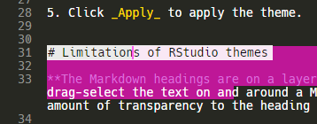
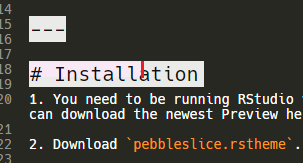

# 'pebbleslice' RStudio 1.2.x theme

_Pebbleslice_ is a dark theme for RStudio, based on Merbivore and extended with colours from Adam Morse's <https://clrs.cc>. The font in the screenshot above is Hack in 10 pt <https://sourcefoundry.org/hack/>.

Some key changes from Merbivore are:

1. More prominent Markdown headings so it's easier to scan for them.
2. More noticeable text cursor (caret), search result highlighting, and text rectangle highlighting.
3. Comments are more noticeable (because you're only leaving important ones).

---

# Installation

1. You need to be running RStudio v 1.2.x. At the time of writing (2019-02-19) this is only available as a Preview, and you can download the newest Preview here <https://www.rstudio.com/products/rstudio/download/preview/>.

2. Download [the newest release of Pebbleslice](https://github.com/DesiQuintans/pebbleslice-theme/releases).

3. In RStudio 1.2.x, go to _Tools_ → _Global Options_ → _Appearance_.

4. Click the _Add_ button underneath the list, choose your downloaded `pebbleslice.rstheme`, and click _Open_.

5. Click _Apply_ to apply the theme.

# Limitations of RStudio themes

**The Markdown headings are on a layer above the text selection layer.** This means that if you use the mouse to drag-select the text on and around a Markdown heading, the heading will be on top of that selection. I have added a small amount of transparency to the heading background colour so that you can see the selection through it, but it's not ideal.

**The editor cannot handle different sizes of text on the same page.** It's possible to make headers visually larger (my first preference), but the cursor and line height does not adopt to the new size of the characters. In the screenshot below, the header protrudes onto line 32. I have also highlighted the whole header line and drawn a red line to mark where the cursor is actually located if I go to the end of the line.

